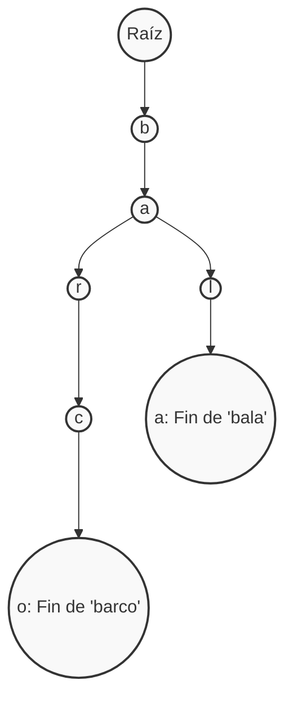
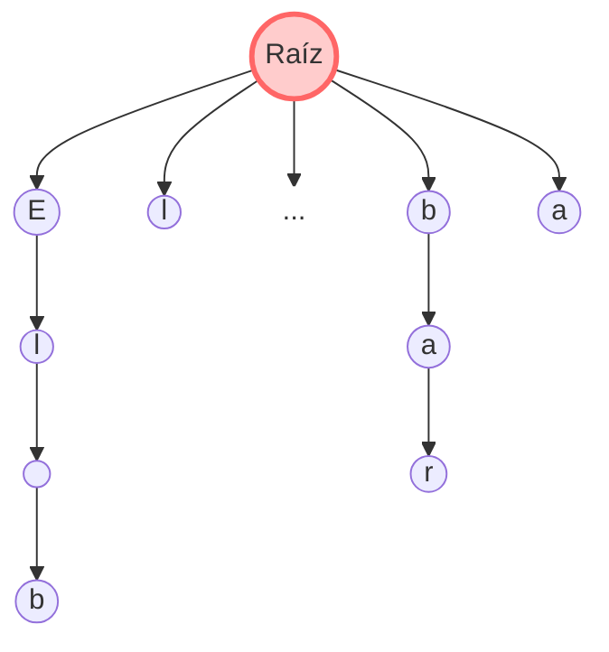
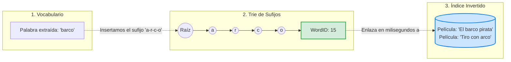
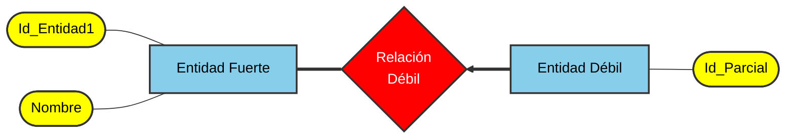

```mermaid
graph TD
    Root((Raíz)) --> B((b))
    B --> A((a))
    
    A --> R((r))
    R --> C((c))
    C --> O((o: Fin de 'barco'))
    
    A --> L((l))
    L --> A2((a: Fin de 'bala'))
    
    classDef node fill:#f9f9f9,stroke:#333,stroke-width:2px;
```

```mermaid
graph TD
    Root((Raíz)) --> E((E))
    Root --> L((l))
    Root --> Esp((...))
    Root --> B((b))
    Root --> A((a))
    
    E --> L2((l))
    L2 --> Esp2(( ))
    Esp2 --> B2((b))
    
    B --> A2((a))
    A2 --> R((r))
    
    style Root fill:#ffcccc,stroke:#f66,stroke-width:3px
    style Esp fill:#fff,stroke:#fff
```

```mermaid
graph LR
    subgraph 1. Vocabulario
        W1["Palabra extraída: 'barco'"]
    end

    subgraph 2. Trie de Sufijos
        Raiz((Raíz)) --> A((a))
        A --> R((r))
        R --> C((c))
        C --> O((o))
        O --> ID["WordID: 15"]
    end

    subgraph 3. Índice Invertido
        DB[("Película: 'El barco pirata'<br>Película: 'Tiro con arco'")]
    end

    W1 -. "Insertamos el sufijo 'a-r-c-o'" .-> Raiz
    ID -. "Enlaza en milisegundos a" .-> DB
    
    style ID fill:#d4edda,stroke:#28a745,stroke-width:2px
    style DB fill:#cce5ff,stroke:#007bff,stroke-width:2px
```

``` mermaid
flowchart RL
    %% Paleta de colores
    classDef entidad fill:#87CEEB,stroke:#333,stroke-width:2px,color:#000
    classDef relacion fill:#FF0000,stroke:#333,stroke-width:2px,color:#FFF
    classDef atributo fill:#FFFF00,stroke:#333,stroke-width:2px,color:#000

    %% Lado derecho
    A3([Id_Parcial]):::atributo --- E2[Entidad Débil]:::entidad

    %% Uso de <br> en el rombo para apilar el texto y reducir su tamaño
    E2 ==> R{Relación<br>Débil}:::relacion

    %% Lado izquierdo
    R === E1[Entidad Fuerte]:::entidad

    %% Atributos
    E1 --- A1([Id_Entidad1]):::atributo
    E1 --- A2([Nombre]):::atributo
```